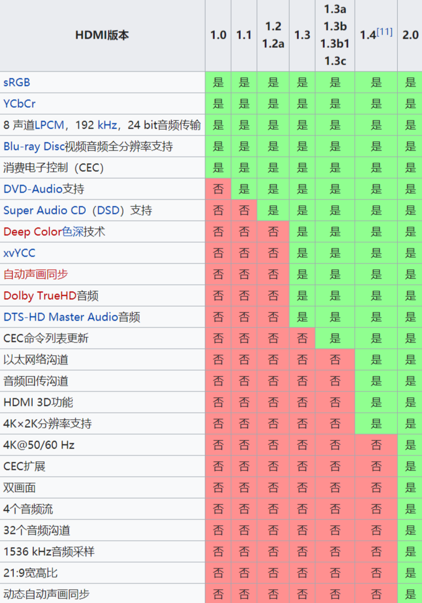

# HDMI 简介

[高清多媒体界面](https://zh.wikipedia.org/wiki/HDMI)（英语：High Definition Multimedia Interface，缩写：HDMI）是一种全数字化影像和声音发送接口，可以发送未压缩的音频及视频信号。HDMI 可用于机顶盒、DVD 播放机、个人电脑、电视游乐器、综合扩大机、数字音响与电视机等设备。HDMI 可以同时发送音频和视频信号，由于音频和视频信号采用同一条线材，大大简化系统线路的安装难度。

HDMI 是被设计来取代较旧的模拟信号影音发送接口如 SCART 或 RCA 等端子的。它支持各类电视与电脑影像格式，包括 SDTV、HDTV 视频画面，再加上多声道数字音频。HDMI 与去掉音频传输功能的 UDI 都继承 DVI 的核心技术“传输最小化差分信号”TMDS，从本质上来说仍然是 DVI 的扩展。DVI、HDMI、UDI 的视频内容都以即时、专线方式进行传输，这可以保证视频流量大时不会发生堵塞的现象。每个像素数据量为 24 位。信号的时序与 VGA 极为类似。画面是以逐行的方式被发送，并在每一行与每祯画面发送完毕后加入一个特定的空白时间（类似模拟扫描线），并没有将数据“Micro-Packet Architecture（微数据包架构）”化，也不会只更新前后两帧画面改变的部分。每张画面在该更新时都会被完整的重新发送。规格初制订时其最大像素传输率为 165Mpx/sec，足以支持 1080p 画质每秒 60 张画面，或者 UXGA 分辨率（1600x1200）；后来在 HDMI 1.3 规格中扩增为 340Mpx/秒，以符合未来可能的需求。

而 DisplayPort 一开始则面向液晶显示器开发，采用“Micro-Packet Architecture(微数据包架构)”传输架构，视频内容以数据包方式传送，这一点同 DVI、HDMI 等视频传输技术有着明显区别。也就是说，HDMI 的出现取代模拟信号视频，而 DisplayPort 的出现则取代的是 DVI 和 VGA 接口。

HDMI 也支持非压缩的 8 声道数字音频发送（采样率 192kHz，数据长度 24bits/sample），以及任何压缩音频流如 Dolby Digital 或 DTS，亦支持 SACD 所使用的 8 声道的 1bit DSD 信号。在 HDMI 1.3 规格中，又追加超高数据量的无损压缩音频流如 Dolby TrueHD 与 DTS-HD 的支持。

标准的 Type A HDMI 接头有 19 个脚位，另有一种支持更高分辨率的 Type B 接头被定义出来，但当前仍无任何厂商使用 Type B 接头。Type B 接头有 29 个脚位，容许其发送扩展的视频沟道以应付未来的高画质需求，如 WQSXGA（3200x2048）。

Type A HDMI 可向下兼容于现今多数显示器与显卡所使用的 Single-link DVI-D 或 DVI-I 接口（但不支持 DVI-A），这表示采用 DVI-D 接口的信号来源可以透过转换线驱动 HDMI 屏幕，但是此种转换方案并不支持音频发送与遥控机能。此外如无 HDCP 认证的 DVI 屏幕也将不能收看从 HDMI 所输出带有 HDCP 加密保护的视频数据（所有 HDMI 屏幕皆支持 HDCP，但大多数 DVI 接口的显示器不支持 HDCP），Type B HDMI 接头也将向下兼容于 Dual-link DVI 接口。

HDMI 组织的发起者包括各大消费电子产品制造商，如日立制作所、松下电器、Quasar、飞利浦、索尼、汤姆生 RCA、东芝、Silicon Image。数字内容保护公司（Digital Content Protection, LLC）[1]提供 HDMI 接口相关的防拷保护技术。此外，HDMI 也受到各主要电影制作公司如 20 世纪福斯、华纳兄弟、迪士尼、环球，包括三星电子在内的各大消费电子产品制造商，以及多家有线电视系统业者的支持。

## 接口版本发展

### HDMI A Type

应用于 HDMI1.0 版本，总共有 19pin，规格为 4.45 mm×13.9 mm，为最常见的 HDMI 接头规格，相点对点于 DVI Single-Link 传输。在 HDMI 1.2a 之前，最大能传输 165MHz 的 TMDS，所以最大传输规格只能在于 1600×1200（TMDS 162.0 MHz）。

### HDMI B Type

应用于 HDMI1.0 版本，规格为 4.45 mm×21.2 mm，总共有 29pin,可传输 HDMI A type 两倍的 TMDS 数据量，相点对点于 DVI Dual-Link 传输，用于传输高清晰度（WQXGA 2560×1600 以上）。因为 HDMI A type 只有 Single-Link 的 TMDS 传输，如果要传输成 HDMI B type 的信号，则必须要两倍的传输效率，会造成 TMDS 的 Tx、Rx 的工作频率必须提高至 270MHz 以上。而在 HDMI 1.3 IC 出现之前，市面上大部分的 TMDS Tx、Rx 只能稳定在 165MHz 以下工作。此类接口未应用在任何产品中。

### HDMI C Type

俗称 mini-HDMI，应用于 HDMI1.3 版本，总共有 19pin，可以说是缩小版的 HDMI A type，规格为 2.42 mm×10.42 mm，但脚位定义有所改变。主要是用在便携式设备上，例如 DV、数字相机、便携式多媒体播放机等。由于大小所限，一些显卡会使用 mini-HDMI，用家须使用转接头转成标准大小的 Type A 再连接显示器。

### HDMI D Type

应用于 HDMI1.4 版本，总共有 19pin，规格为 2.8 mm×6.4 mm，但脚位定义有所改变。新的 Micro HDMI 接口将比现在 19 针 MINI HDMI 版接口小 50％左右，可为相机、手机等便携设备带来最高 1080p 的分辨率支持及最快 5GB 的传输速度。

## HDMI 协议发展历史

版本列表：

- HDMI 1.1/1.2
  - HDMI 1.1
  - HDMI 1.2
  - HDMI 1.2a
- HDMI 1.3
  - HDMI 1.3a
  - HDMI 1.3b
  - HDMI 1.3b1
  - HDMI 1.3c
- HDMI 1.4
  - HDMI 1.4a
  - HDMI 1.4b
- HDMI 2.0
  - HDMI 2.0a
  - HDMI 2.0b
- HDMI 2.1

HDMI 版本对比

HDMI 屏幕分辨率

HDMI 支持的功能

