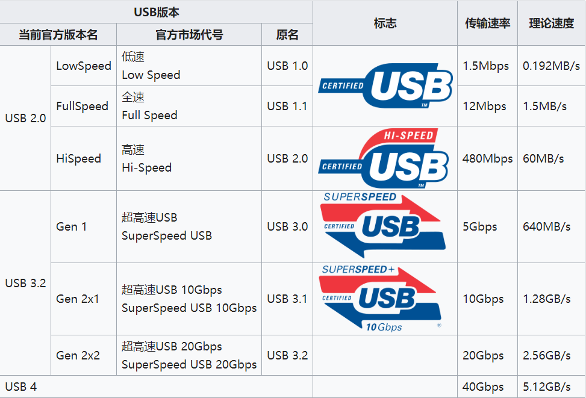
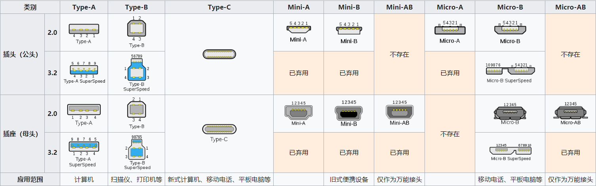
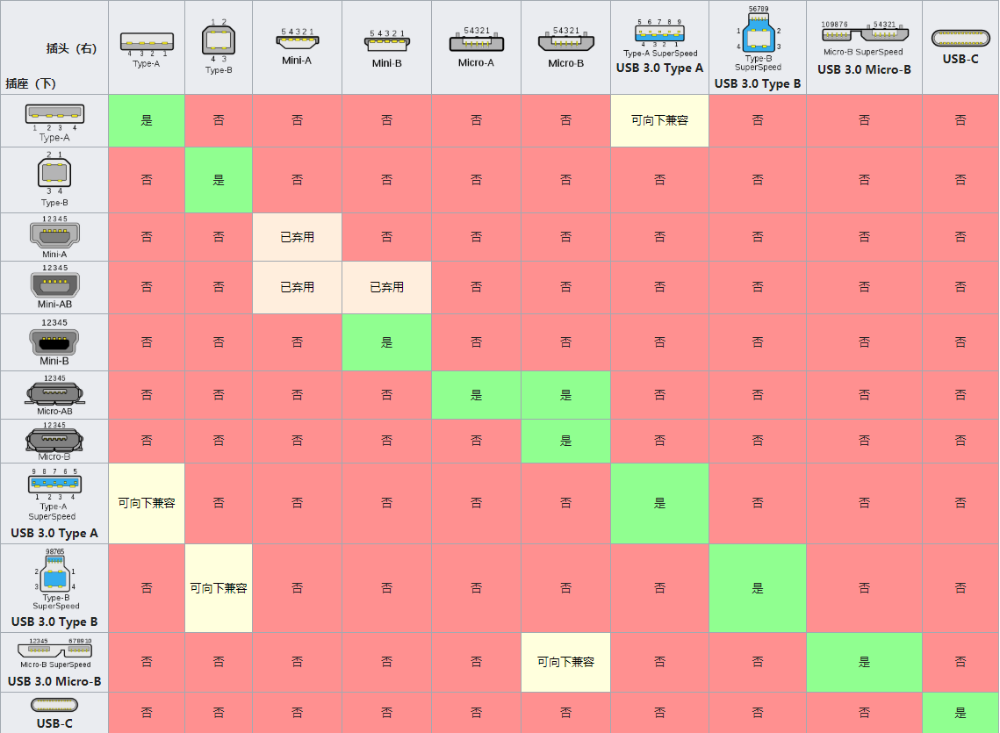
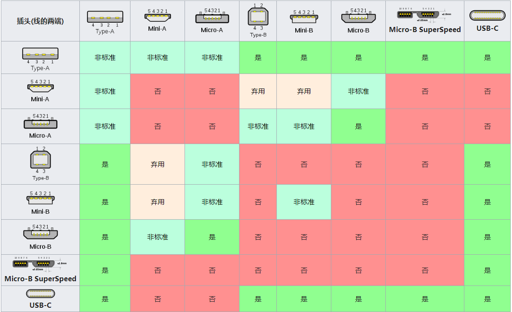
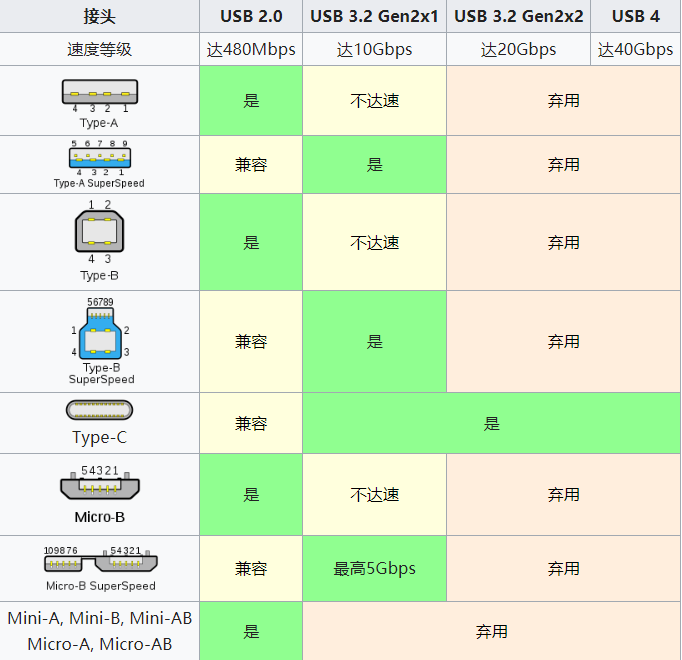
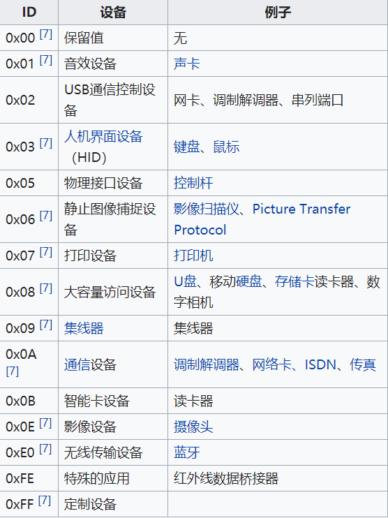

# USB 介绍

[通用串行总线](https://zh.wikipedia.org/wiki/USB)（英语：Universal Serial Bus，缩写：USB）是连接计算机系统与外部设备的一种串口总线标准，也是一种输入输出接口的技术规范，被广泛地应用于个人电脑和移动设备等信息通讯产品，并扩展至摄影器材、数字电视（机顶盒）、游戏机等其它相关领域。

多媒体电脑刚问世时，外接式设备的传输接口各不相同，如打印机只能接 LPT、调制解调器只能接 RS232、鼠标键盘只能接 PS/2 等。繁杂的接口系统，加上必须安装驱动程序并重启才能使用的限制，都会造成用户的困扰。因此，创造出一个统一且支持易插拔的外接式传输接口，便成为无可避免的趋势，USB 应运而生。

最新一代的 USB 是 USB4，传输速度为 40Gbit/s。另外仅有个别的 USB Type-A、Micro-B 以及新型 USB Type-C 接头不再分正反。

## USB 发展历史

USB 协议版本

USB 协议和USB外形对比

==Type-A，Type-B，Type-C，Type mini A/B，micro A/B 是 USB 接口的外形，USB2.0，USB3.2 是 USB 接口的协议规范。Type-A，Type-B,Type-C 都支持所有协议，但是 A，B 只是支持到 USB 3.2 gen1 协议，后面的协议不支持，其中 A，B 外形有些不一致，以及速度不达标准等。mini 系列和 micro 系列中，除了 micro B 有 USB 3.0 协议的实现之外，其他没有 USB 3.0 高速版本的实现。==

USB插头和插座的兼容

==其中 Type A 3.0 协议项下兼容 Type-A 2.0，其中 Type-B 3.0 协议项下兼容 Type-B 2.0 协议，Micro-B 向下兼容 Micro-A==

USB线（线的两头）

USB插座

USB设备id

==通过对 USB 数据包特定字段设置值，来告诉连被连接设备，当前正在连接外设的类别，方便被连接设备根据 id 来处理收到的数据包。==

## 根据外形区分 USB 版本

### Type-A

对于插头，2.0 协议的只有 4 个引脚，3.0 协议的另外添加了 5 个引脚
对于插座，2.0 协议的只有 4 个引脚，3.0 协议的另外添加了 5 个引脚
对于某些插头和插座可以通过颜色来区分，2.0 的为黑色，3.0 的为蓝色
3.0 的版本向下兼容 2.0 的版本
==主要适用于计算机，旧式笔记本电脑==

### Type-B

2.0 的协议的有 4 个引脚，3.0 协议的另外添加了 5 个引脚
也可以用过颜色来区分
3.0 的版本向下兼容 2.0 的版本
==主要适用于外设如扫描、打印机等==

### Type-C

总共 24 个引脚，所有协议都适用。
==适用于新式计算机、新式移动电话、平板电脑、以及新式笔记本电脑==

### Mini-A & Mini-B

只有 2.0 协议的版本，没有 3.0 协议的版本，只有 5 个引脚
不向下兼容

### Micro-B

2.0 协议的有 5 个引脚，3.0 协议的另外添加了 5 个引脚。
3.0 协议的版本向下兼容 2.0 协议的版本
==适用于旧式移动电话、旧式平板电脑==
